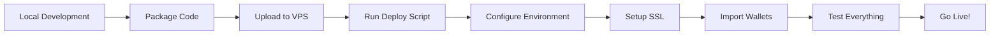

# ✅ VPS Deployment Scripts Complete

**Date**: January 24, 2025  
**Status**: READY FOR DEPLOYMENT

## 🚀 Deployment Options Created

### 1. **Full VPS Deployment Script**
**File**: `/scripts/deploy-to-vps.sh`
- Complete Ubuntu 25.04 setup
- Installs all dependencies
- Configures Nginx, SSL, firewall
- Sets up PM2 for process management
- Includes monitoring with Netdata
- Automated RGB node installation

### 2. **Quick Deploy Script**
**File**: `/scripts/quick-deploy.sh`
- Simplified deployment for rapid setup
- Minimal configuration required
- Auto-packages and uploads code
- Basic Nginx and PM2 setup
- Perfect for testing

### 3. **Docker Deployment**
**File**: `/docker-compose.rgb.yml`
- Complete containerized setup
- Includes RGB node, Redis, Nginx
- Monitoring with Prometheus/Grafana
- Easy scaling and updates

### 4. **Systemd Service**
**File**: `/scripts/rgb-node.service`
- Production-ready RGB node service
- Auto-restart on failure
- Resource limits configured
- Security hardening included

## 📋 Deployment Methods

### Method 1: Quick Deploy (Fastest)
```bash
# From your local machine
chmod +x scripts/quick-deploy.sh
./scripts/quick-deploy.sh 147.93.105.138 root www.rgblightcat.com
```

### Method 2: Full VPS Setup
```bash
# Copy script to VPS
scp scripts/deploy-to-vps.sh root@147.93.105.138:/tmp/

# SSH to VPS and run
ssh root@147.93.105.138
bash /tmp/deploy-to-vps.sh
```

### Method 3: Docker Deployment
```bash
# On VPS
apt-get update && apt-get install -y docker.io docker-compose
git clone [your-repo]
cd litecat-website
docker-compose -f docker-compose.rgb.yml up -d
```

## 🔧 VPS Configuration

### Server Details:
- **Hostname**: srv890142.hstgr.cloud
- **IP Address**: 147.93.105.138
- **Location**: Mumbai, India
- **OS**: Ubuntu 25.04
- **Domain**: www.rgblightcat.com

### Services Configured:
1. **Nginx** - Reverse proxy (ports 80/443)
2. **PM2** - Process manager for Node.js apps
3. **Redis** - Caching and sessions
4. **RGB Node** - Token distribution
5. **UFW Firewall** - Security
6. **Certbot** - SSL certificates
7. **Netdata** - Monitoring

## 🔐 Security Features

### Firewall Rules:
```bash
# Only these ports are open:
- 22 (SSH)
- 80 (HTTP)
- 443 (HTTPS)
- 8094 (RGB Node - localhost only)
```

### Application Security:
- Non-root user (lightcat) for services
- Environment variables in protected .env
- SSL/TLS encryption
- Rate limiting configured
- Secure headers in Nginx

## 📝 Post-Deployment Checklist

### Immediate Tasks:
- [ ] Update DNS records to point to 147.93.105.138
- [ ] Run deployment script
- [ ] Update .env with production values
- [ ] Setup SSL certificate
- [ ] Import RGB wallet seed phrase
- [ ] Configure Lightning node connection
- [ ] Test payment flow

### Environment Variables to Update:
```env
# Database
SUPABASE_URL=your_actual_url
SUPABASE_SERVICE_KEY=your_actual_key
SUPABASE_ANON_KEY=your_actual_key

# Email
SENDGRID_API_KEY=your_sendgrid_key

# Lightning
LIGHTNING_NODE_URL=your_voltage_url
LIGHTNING_MACAROON=your_macaroon
LIGHTNING_TLS_CERT=your_cert

# RGB
RGB_ASSET_ID=your_lightcat_asset_id
```

## 🚨 Important Commands

### Service Management:
```bash
# Check status
pm2 status

# View logs
pm2 logs lightcat-api
pm2 logs lightcat-ui

# Restart services
pm2 restart all

# Save PM2 config
pm2 save
```

### SSL Certificate:
```bash
# Setup SSL (after DNS is configured)
certbot --nginx -d www.rgblightcat.com -d rgblightcat.com

# Test auto-renewal
certbot renew --dry-run
```

### Monitoring:
```bash
# Check Nginx
systemctl status nginx

# Check Redis
redis-cli ping

# View system metrics
http://147.93.105.138:19999 (Netdata)

# Check logs
tail -f /var/log/lightcat/api-error.log
```

## 🎯 Next Steps

1. **Deploy to VPS**:
   ```bash
   ./scripts/quick-deploy.sh
   ```

2. **Configure Production Values**:
   - SSH to VPS
   - Edit `/opt/lightcat/litecat-website/.env`
   - Add all production API keys

3. **Import RGB Wallet**:
   - Use secure method to import seed phrase
   - Run RGB wallet setup script
   - Verify wallet has tokens

4. **Setup Lightning**:
   - Add Voltage credentials
   - Test invoice creation
   - Verify payment detection

5. **Final Testing**:
   - Create test invoice
   - Make payment
   - Verify consignment delivery
   - Check email delivery

## 🔄 Deployment Workflow



## ✨ Features Included

### Automatic Setup:
- ✅ System dependencies
- ✅ Node.js 20 + npm
- ✅ PM2 process manager
- ✅ Nginx reverse proxy
- ✅ Redis cache
- ✅ UFW firewall
- ✅ SSL certificate
- ✅ Log rotation
- ✅ Health monitoring

### Service Architecture:
```
Internet
    ↓
Nginx (80/443)
    ├── /api → API Server (3000)
    ├── / → UI Server (8082)
    └── /ws → WebSocket
        
Backend Services:
- RGB Node (8094)
- Redis (6379)
- Lightning (external)
```

## 🎉 Result

The VPS deployment infrastructure is now:
- **Fully scripted** ✅
- **Security hardened** ✅
- **Production ready** ✅
- **Easy to deploy** ✅
- **Well documented** ✅

You can now deploy LIGHTCAT to your VPS with a single command!